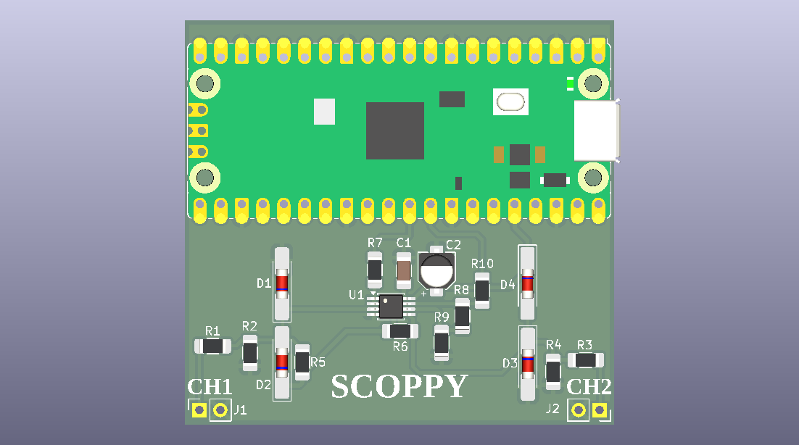
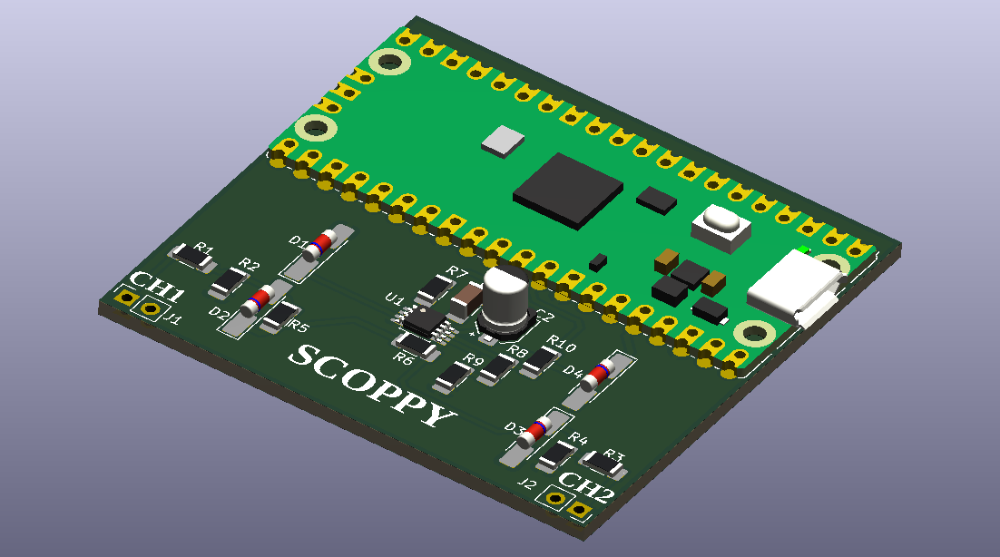

# scoppy
PI Pico ossciloscope using simple components

The project contains multiple directory, each with its own kind of Scopy, i.e Surface mountable, through hole, etc...

The Directory names are self explanatory. 

Some Images to show how scoppy might look

